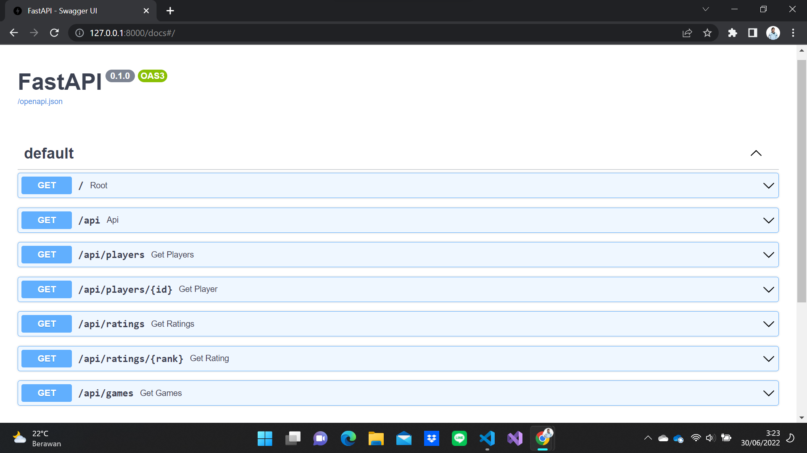
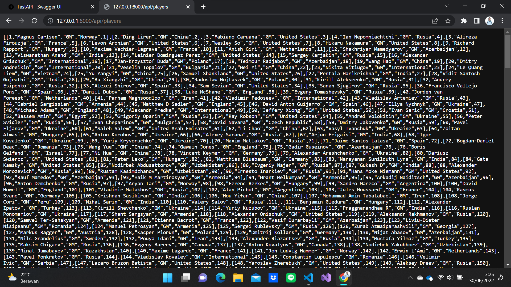
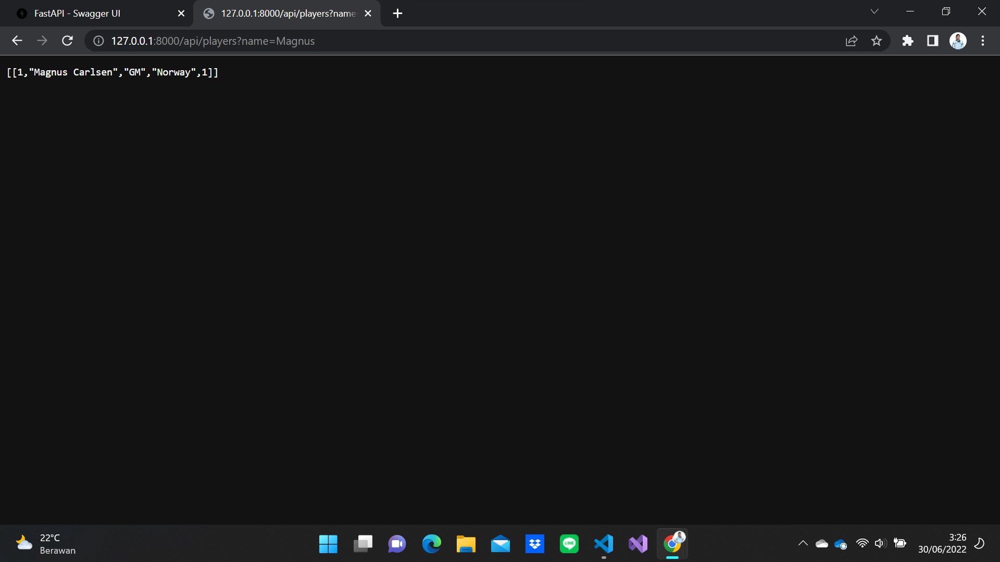
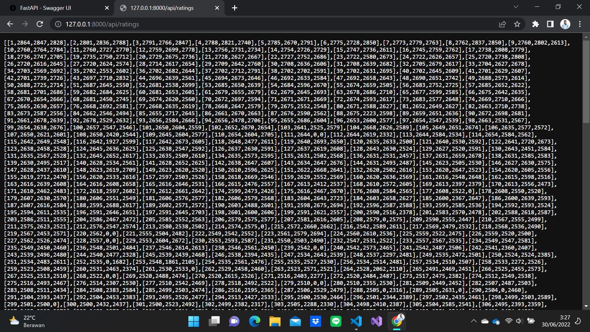
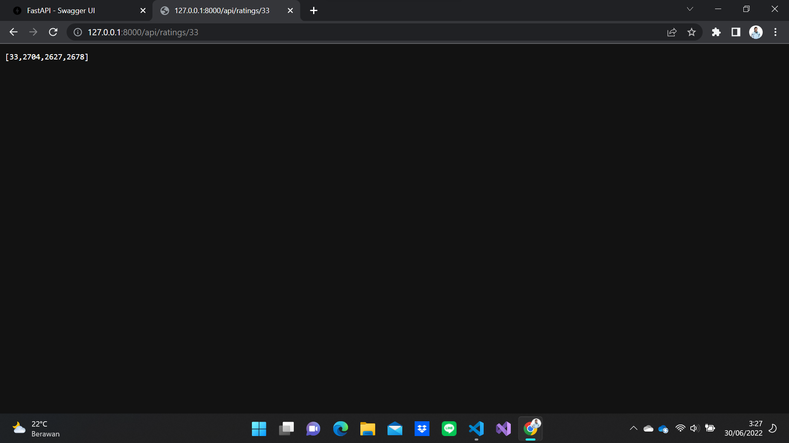
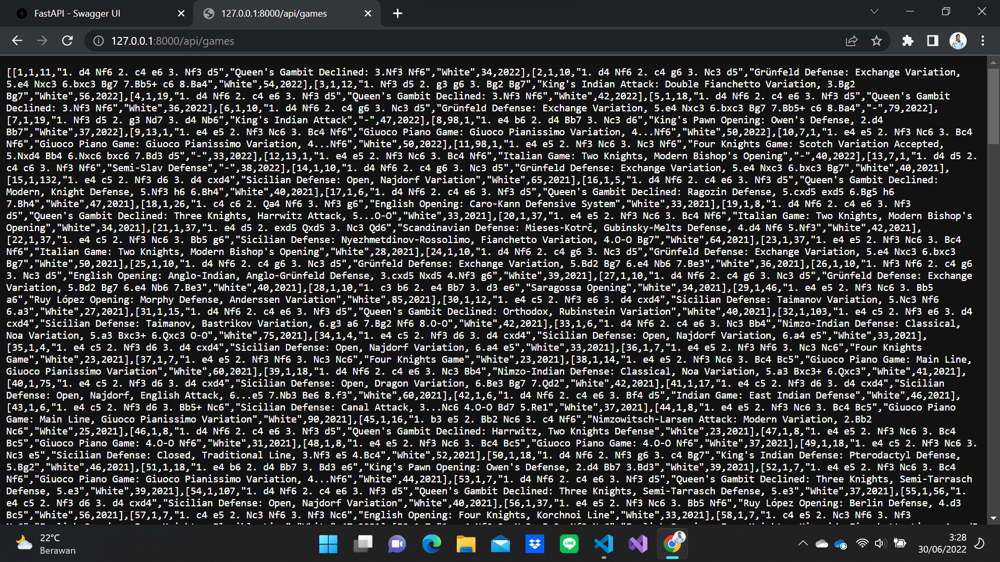
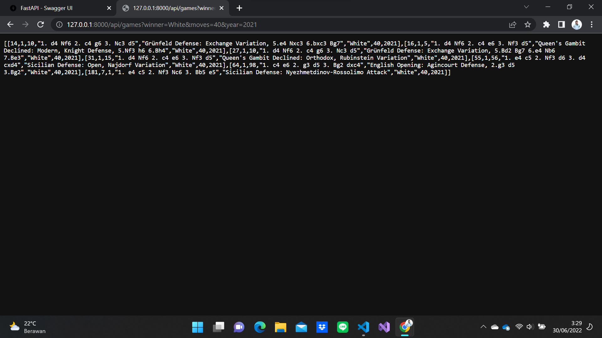

<h1 align="center">
  Seleksi Warga Basdat 2022
</h1>

<h2 align="center">
  Tugas 1 : Data Scraping & Data Storing
</h2>

<h3 align="center">
  sumber data: chess.com
</h3>


## Daftar Isi
* [Deskripsi Data dan DBMS](#deskripsi-data-dan-dbms)
* [Spesifikasi Program](#spesifikasi-program)
* [Cara Menggunakan](#cara-menggunakan)
* [Struktur JSON](#struktur-json)
* [Struktur Basis Data](#struktur-basis-data)
* [Screenshot](#screenshot-program)
* [Referensi](#referensi)
* [Author](#author)

## Deskripsi Data dan DBMS
Catur adalah salah satu cabang olahraga yang cukup digemari. Kini, bermain catur menjadi lebih praktis dengan adanya website chess.com. Segala informasi terkait catur tersedia sangat lengkap di dalamnya. Oleh karena itu, penulis memilih website ini sebagai sumber data. Data yang diambil dari chess.com ini adalah data 1000 pemain top dunia berdasarkan rating dari FIDE beserta rekaman pertandingan yang pernah dimainkan oleh pemain bernama Magnus Carlsen, pemegang Juara Dunia Catur saat ini, di tahun 2020 atau lebih.

Untuk menyimpan data tersebut, penulis memilih PostgreSQL sebagai DBMS. Hal ini karena PostgreSQL merupakan DBMS yang memiliki reputasi yang baik dan dapat diandalkan. Selain itu, PostgreSQL juga menyediakan alat yang memudahkan pengelolaan database.

## Spesifikasi Program
Program _data scraping_ pada proyek ini menggunakan bahasa Python dengan pustaka _HTML parser_ yang umum dipakai untuk melakukan _data scraping_, yaitu Beautiful Soup.

Selain itu, terdapat sebuah API sederhana menggunakan pustaka FastAPI yang disediakan oleh Python.
## Cara Menggunakan
### Program
1. Pastikan Python3 ter-_install_ pada PC Anda. Jika tidak, silakan unduh Python3 [di sini](https://www.python.org/downloads/)
2. Pastikan PostgreSQL ter-_install_ pada PC Anda. Jika tidak, silakan unduh PostgreSQL [di sini](https://www.postgresql.org/download/)
3. Atur konfigurasi pada file `.env` di folder `Data Scraping/src` sesuai dengan lokasi database di PC anda.
4. Buka folder `Data Scraping/src` di terminal.
5. Jalankan perintah di bawah ini untuk mengunduh pustaka yang dibutuhkan.
```
pip install -r requirements.txt
```
6. Jalankan perintah di bawah ini untuk menjalankan program _scraping_ dan _storing_ data
```
python main.py
```
3. Ikuti perintah selanjutnya yang diberikan pada CLI

### API
1. Atur konfigurasi pada file `.env` di folder `API/src` sesuai dengan lokasi database di PC anda.
2. Buka terminal lalu pindah ke direktori `src` di dalam folder `API`
3. Jalankan perintah di bawah ini untuk mengunduh pustaka yang dibutuhkan
```
pip install -r requirements.txt
```
4. Jalankan perintah di bawah ini untuk menjalankan API di `localhost:8000`
```
uvicorn main:app --reload
```
5. Buka browser dan akses `localhost:8000`, tambahkan `/docs` di akhir URL untuk memunculkan Swagger UI
6. Selamat menggunakan API

## Struktur JSON
1. `players.json`
```
{ 
  Rank: ranking FIDE pemain
  Name: nama pemain
  Title: gelar pemain
  Nationality: kewarganegaraan pemain
  Rating: rating pemain yang terdiri dari 3 jenis
  {
    Classic: rating catur klasik
    Rapid: rating catur cepat
    Blitz: rating catur kilat
  }
}
```
2. `games.json`
```
{
  White: nama pemain putih
  Black: nama pemain hitam
  Notation: notasi langkah awal permainan
  Opening: pembukaan catur yang dimainkan
  Winner: pemain yang menang
  Moves: jumlah langkah
  Year: tahun dilaksanakannya pertandingan
}
```

## Struktur Basis Data


## Screenshot Program
- Data Scraping


- Data Storing


- API









## Referensi
### Pustaka
- Beautiful Soup
- Psycopg2
- Python-dotenv
- Fast API

### Tautan
- Web Scraping Tutorial: [YouTube - Web Scraping Bukalapak dengan Python || Bahasa Indonesia](https://www.youtube.com/watch?v=wGIpT9JCN3c&t=426s)
- Dokumentasi PostgreSQL: [PostgreSQL Documentation](https://www.postgresql.org/docs/)
- FastAPI Tutorial: [YouTube - Python FAST API Tutorial](https://www.youtube.com/watch?v=-ykeT6kk4bk&t=2347s)
## Author
Diky Restu Maulana \
13520017 \
Teknik Informatika, Institut Teknologi Bandung