<h1 align="center">
  <br>
  Data Penjualan Properti di Indonesia
  <br>
  <br>
</h1>

<h2 align="center">
  <br>
  Data Scraping & Data Storing Website dotproperty.id
  <br>
  <br>
</h2>

## Description
- Pada __Tugas 1 Seleksi Lab Basis Data__ ini, Saya mengambil _website_ <a href = https://www.dotproperty.id/properties-for-sale> dotproperty</a> sebagai _website_ yang akan Saya lakukan _scraping_. Alasan pengambilan _website_ ini sebagai topik Saya dikarenakan informasi penjualan properti merupakan salah satu hal yang cukup banyak dicari oleh masyarakat Indonesia saat ini. Sehingga, dengan adanya data penjualan properti di Indonesia ini diharapkan dapat membantu pihak-pihak yang sedang mencari properti. Kemudian, alasan selanjutnya adalah _website_ ini cukup menarik untuk dapat dilakukan _scraping_ karena jumlah data yang tidak terlalu sedikit dan cukup banyak informasi yang bisa didapatkan dari _website_ ini.
- DBMS yang akan Saya gunakan adalah MongoDB karena DBMS ini dapat melakukan _storing_ data yang cukup cepat, fleksibel, dan yang paling penting adalah DBMS ini mampu untuk melakukan _storing_ data menggunakan format file `.json`. Sehingga, DBMS ini adalah pilihan yang paling tepat untuk dapat bekerja menggunakan format file `.json` seperti yang diminta oleh tugas ini.
## Spesifikasi
Dalam pengerjaan tugas ini, Saya menggunakan beberapa _tools_ dan _libraries_ yang dibutuhkan agar program ini dapat berjalan..
### Libraries
Dalam tahap pengerjaan, Saya menggunakan beberapa _library_ yang disediakan oleh `Python`, diantaranya:
- JSON
<br>_Library_ bawaan dari `Python` yang akan berfungsi untuk melakukan pembacaan dan penulisan dalam format `.json`.
- Requests
<br>_Library_ yang digunakan untuk dapat mengakses suatu _website_ dan dapat meminta objek dari _website_ tersebut.
- BeautifulSoup4
<br>Merupakan _library_ utama yang kita butuhkan dalam melakukan _Web Scraping_. _Library_ ini yang akan membuat kita dapat mengakses satu per satu objek yang terdapat di dalam _Website_ yang ingin kita _scrape_. _Library_ ini bukan merupakan _library_ bawaan yang langsung terinstal ketika kita menggunakan `python`, sehingga kita perlu melakukan instalasi terhadap _library_ ini dengan cara membuat _command_ `pip install BeautifulSoup4` di terminal.
- OS
<br>_Libray_ yang akan digunakan untuk mengatur penamanaan file sesuai dengan masukan dari pengguna dan mengatur peletakan file di dalam suatu folder yang sudah didefinisikan.

## How to Run
- Clone _repository_ ke _local computer_ Anda.
- Install seluruh _library_ yang dibutuhkan untuk menjalankan program.
- Edit bagian `file_path` yang ada pada `webScraper.py` untuk mengatur dimana file hasil _scrape_ ingin Anda simpan.
- Jalankan `webScraper.py`.
- Tepat setelah menjalankan program tersebut, maka akan muncul permintaan _input_ berupa nama file yang ingin Anda simpan.
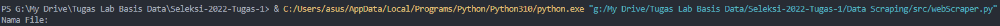

## Screenshot
- Import Required Libraries
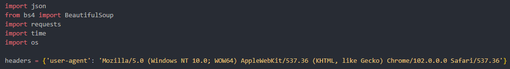
- Fungsi Utama Program
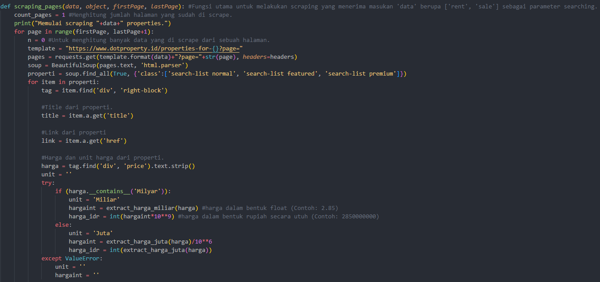
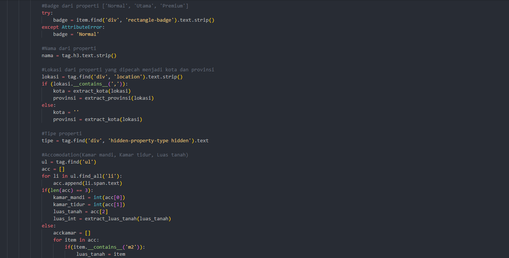
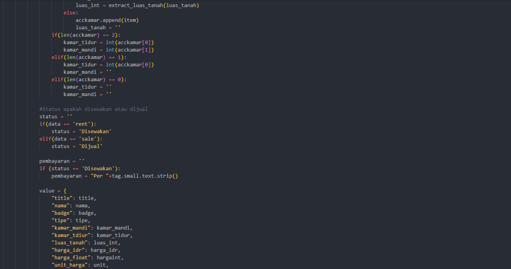
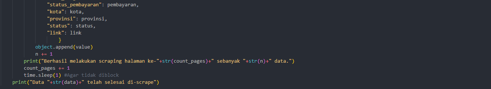
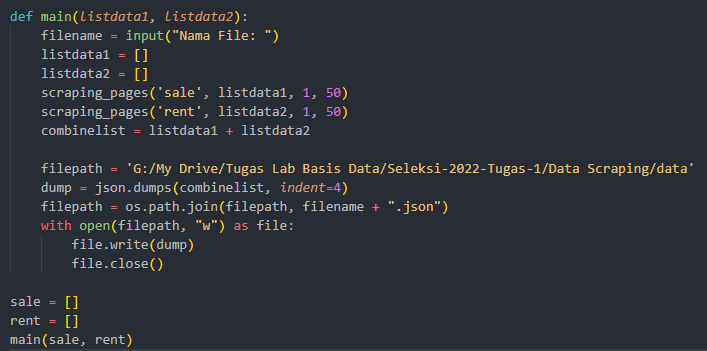
- Fungsi Pendukung

- Run Program
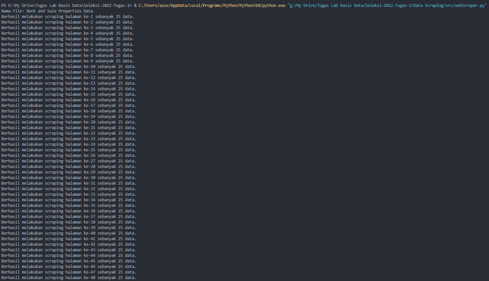
## Data Storing with MongoDB Atlas
- Buat akun di [MongoDB Atlas](https://cloud.mongodb.com/) dan buat sebuah _cluster_ yang diberikan gratis oleh MongoDB.
<br>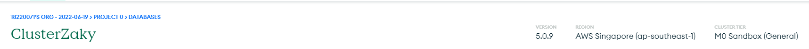
- Atur `Network Access` sedemikian rupa agar _database_ dapat diakses oleh seluruh orang.
<br>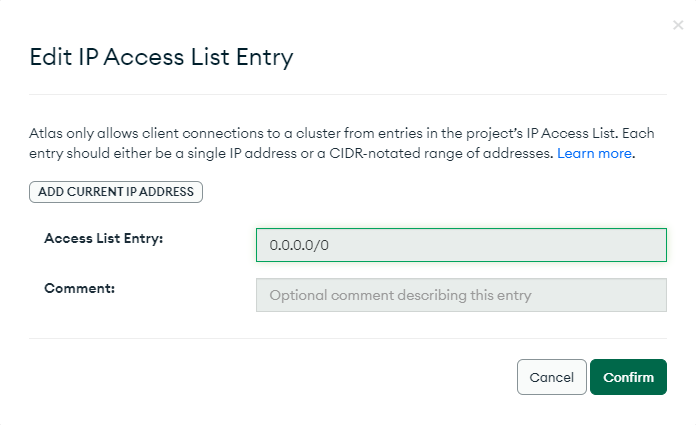
- Pastikan sudah melakukan instalasi MongoDB sekaligus dengan MongoDBCompass.
- Kemudian, `connect` _cloud database_ dengan menggunakan MongoDBCompass dan _copy_ `connection string`.
<br>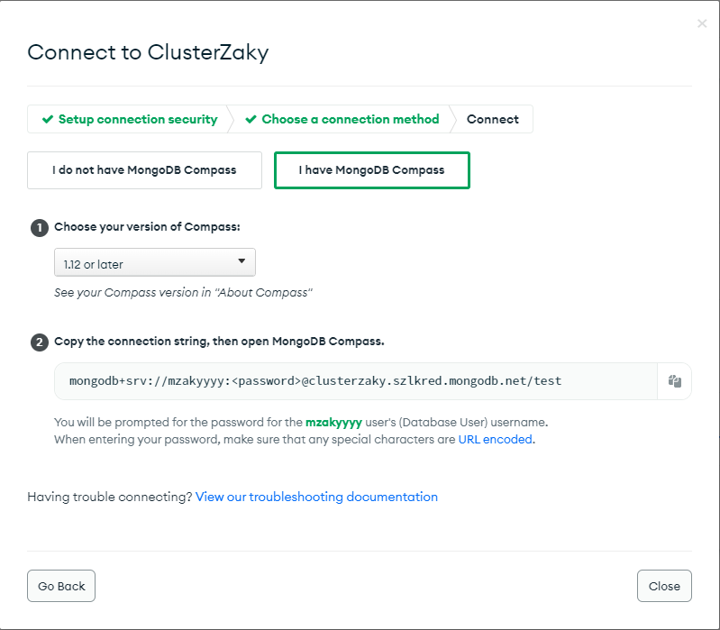
- Lalu, masuk ke MongoDBCompass dan `connect` dengan `connection string` yang sudah di-_copy_ tadi.
- Kemudian, buat database serta collection.
<br>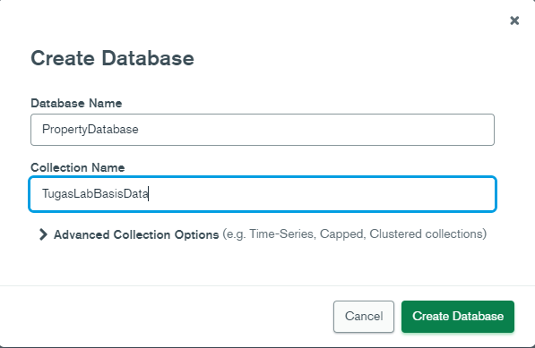
- Kemudian, ambil pilihan `ADD DATA` dan pilih `Import File` dan kemudian pilih file `.json` yang dihasilkan dari _web scraping_ tadi.
<br>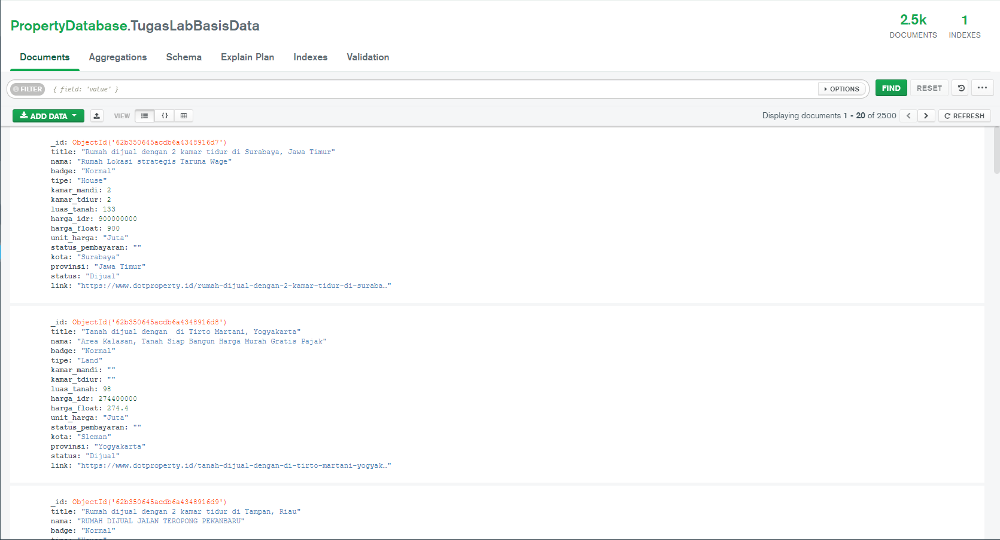
- Kemudian, lakukan _export database_ tersebut menjadi file `.json`.
<br>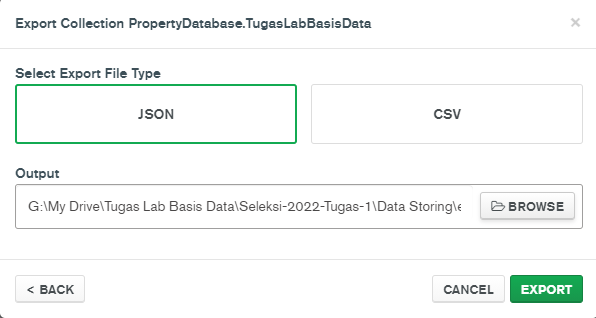
- Terakhir, cek MongoDB Atlas apakah _database_ yang dibuat tadi sudah masuk ke dalam _cloud database_.
<br>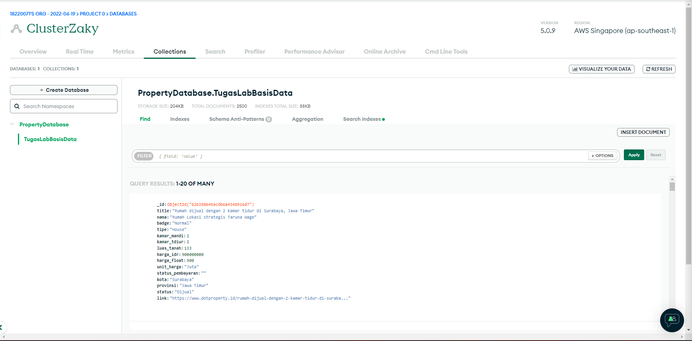

## JSON Structure
```
{
_id: {
  $oid                        : ID yang dihasilkan oleh export database dari MongoDB
}
title {string}                : Judul dari properti yang diambil dari website.
nama {string}                 : Nama dari properti yang diambil dari website.
badge {String}                : Badge dari properti yang valuenya berada di antara ["Normal", "Utama", "Premium"]
tipe {String}                 : Tipe dari properti dan valuenya bisa berupa "House", "Land", "Condo", "Apartment", "Commercial".
kamar_mandi {integer}         : Jumlah kamar mandi dari properti tersebut.
kamar_tidur {integer}         : Jumlah kamar tidur dari properti tersebut.
luas_tanah {float}            : Besarnya luas tanah properti tersebut.
harga_idr {integer}           : Harga properti tersebut dalam satuan rupiah (Contoh: 28000000).
harga_float {float}           : Harga dari properti dalam satuan yang lebih kecil (Contoh: 2.8).
unit_harga {string}           : Unit harga berupa "Miliar" atau "Juta".
status_pembayaran {string}    : Ini merupakan atribut yang dimiliki oleh properti yang disewakan.
kota {string}                 : Kota dimana properti tersebut berada.
provinsi {string}             : Provinsi dimana properti tersebut berada.
status {string}               : Berupa "disewakan" atau "dijual".
link {string}                 : Link untuk mengakses properti tersebut.
}
```
## Database Structure
Dari proses _scraping_ ini dihasilkan sebuah relasi yang memiliki _primary key_ berupa `_id` dan memiliki 15 atribut.
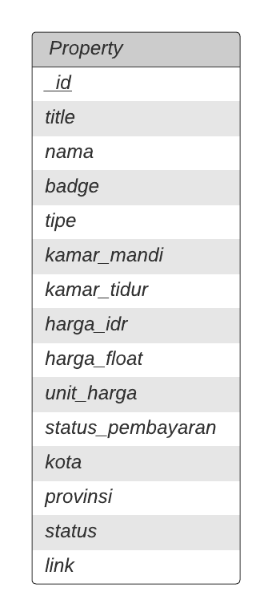
## API
### Deskripsi API
API yang Saya gunakan menggunakan `FastAPI` yang disediakan oleh `Python`. Penggunaan _library_ ini dikarenakan mudah di dalam penggunaannya dan sudah _support_ `Swagger UI` tanpa perlu melakukan proses yang panjang. API ini pada dasarnya berfungsi untuk berinteraksi dengan _cloud database_ yang sudah didefinisikan sebelumnya. Sehingga, ada beberapa hal yang bisa dilakukan dengan menggunakan API ini, yaitu:
1. READ: API ini bisa melakukan _read_ terhadap data, seperti membaca semua data, membaca data di kota tertentu, dan membaca data di provinsi tertentu.
2. CREATE: API ini juga mendukung untuk pengguna bisa memasukkan data baru ke dalam _database_ property.
3. UPDATE: API ini juga mendukung untuk melakukan modifikasi terhadap data yang sudah ada.
4. DELETE: API ini mendukung untuk melakukan penghapusan data sesuai dengan ID tertentu.
<br>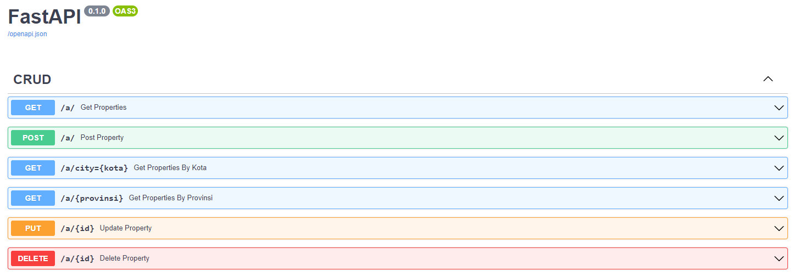
<br>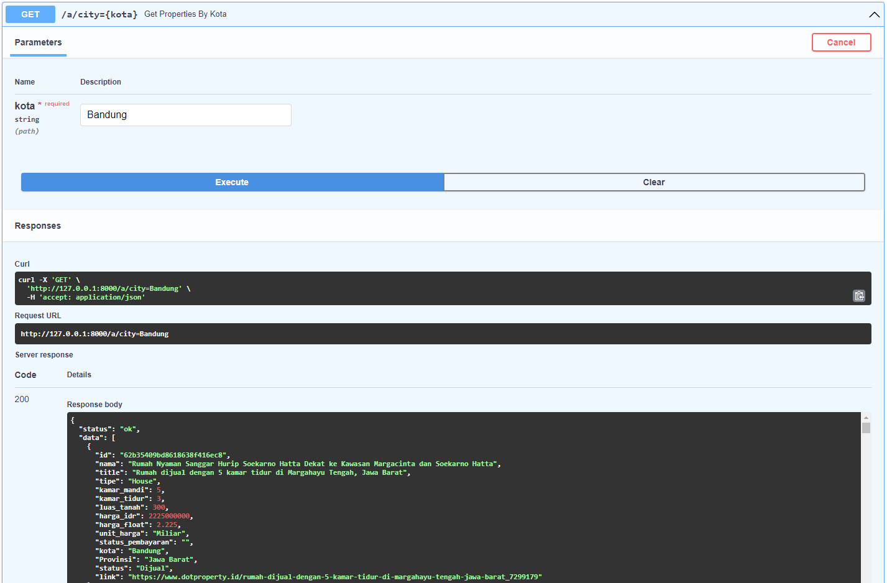
### Cara Menggunakan API
1. Buka terminal, kemudian arahkan ke path dari _clone repository_ tadi dan jalankan `uvicorn main:app`.
2. Kemudian, ikuti `https://127.0.0.1:8000` dan pada url tambahkan `/docs` untuk mengaktifkan `Swagger UI`.
## References
- Dokumentasi dari semua _library_ yang digunakan: [PyPi](https://pypi.org/)
- Belajar Dasar Web Scraping menggunakan YouTube: [Python Tutorial: Web Scraping with BeautifulSoup and Requests](https://www.youtube.com/watch?v=ng2o98k983k)
- Belajar Dasar Fast API menggunakan YouTube: [FastAPI MongoDB REST API w/ Python and PyMongo | CRUD Operations mongodb | Swagger UI |](https://www.youtube.com/watch?v=MXwcUrI-iss)
- Dokumentasi dari MongoDB: [MongoDB](https://mongodb.com)
- _Website_ untuk bertanya:
<br> - [GeeksforGeeks](https://www.geeksforgeeks.org/)
<br> - [Stack Overflow](https://stackoverflow.com/)
## Author
### Muhammad Zaky
### 18220071
### Sistem dan Teknologi Informasi
