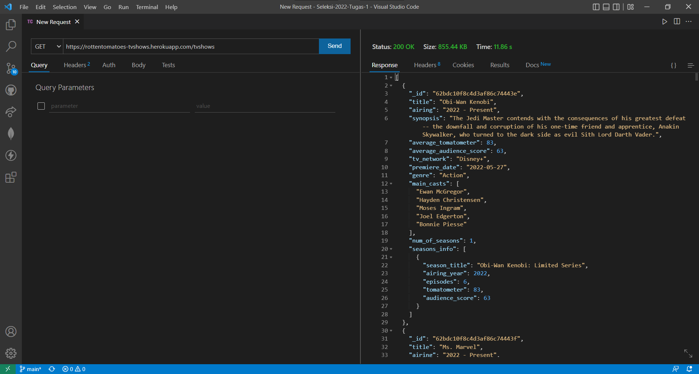
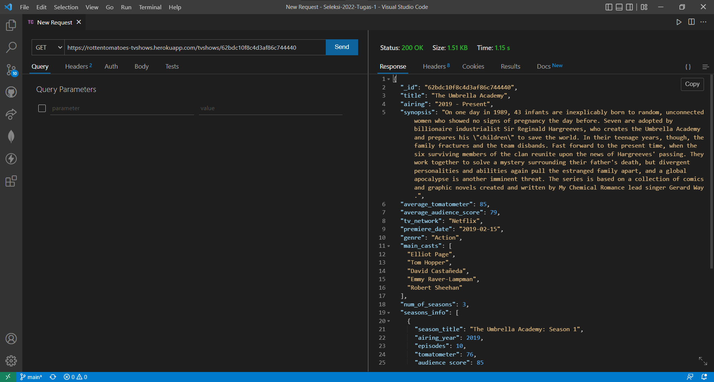
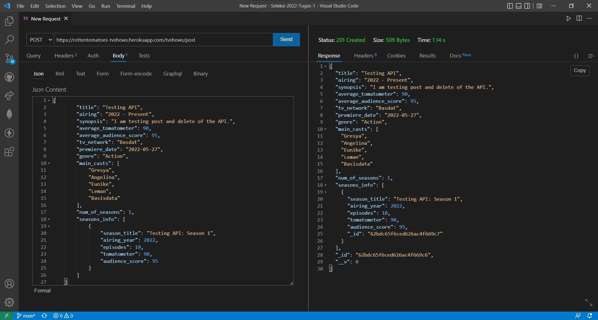
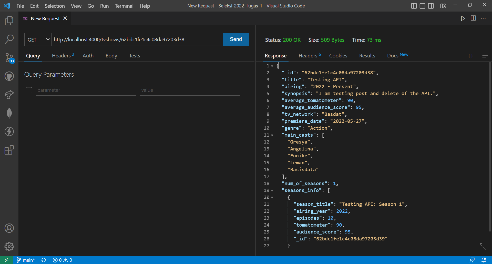
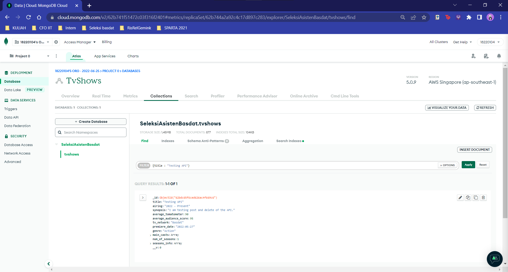

<h1 align="center">
  <br>
  Popular Tv Shows
  <br>
  <br>
</h1>

<h2 align="center">
  <br>
  Data Scraping, Data Storing, and Data Visualization from rottentomatoes.com
  <br>
  <br>
</h2>


## Table of Contents
- [Web Scraper](#web-scraper)
  - [Description](#description)
  - [Spesification](#spesification)
    - [Libraries](#libraries)
    - [Tools](#tools)
  - [How to Use](#how-to-use)
  - [JSON Structure](#json-structure)
  - [Database Structure](#database-structure)
  - [Screenshots](#screenshots)
- [API](#api)
  - [Description](#description-1)
  - [Spesification](#spesification-1)
    - [Libraries](#libraries-1)
    - [Tools](#tools-1)
  - [How to Use](#how-to-use-1)
  - [Testing Screenshots](#testing-screenshots)
    - [API Testing](#api-testing)
  - [Data Visualization](#data-visualization)
  - [References](#references)
  - [Author](#author)

# Web Scraper
## Description
As written on the website, <a href = 'https://www.rottentomatoes.com/' > Rotten Tomatoes</a> and the Tomatometer score are the world’s most trusted recommendation resources for quality entertainment. As the leading online aggregator of movie and TV show reviews from critics, they provide fans with a comprehensive guide to what’s Fresh – and what’s Rotten – in theaters and at home. This website provides general information on movies and TV shows and also their reviews containing the tomatometer score and the audience score. Tomatometer score is based on the opinions of hundreds of film and television critics and is a trusted measurement of critical recommendation for millions of fans. And the audience score represents the percentage of users who have rated a movie or TV show positively.

The author decided to scrape the contents of the most popular TV shows on <a href = 'https://www.rottentomatoes.com/browse/tv_series_browse/sort:popular?page=1'> this website </a> because of the increase in entertainment consumption since the COVID-19 outbreak, especially in TV shows or series. A number of companies in the entertainment industry took this chance and so released a lot of new TV shows and series. But since the beginning of 2022, people has been starting to go back to their normal routines and that resulted in less leisure time. Considering that condition, the author decided to do this project to help people decide what to watch according to the most popular TV shows or series at that time by providing the information on the TV show or series along with its ratings.

The DBMS used to store the result of web scraping in this project is <a href='https://www.mongodb.com/'> MongoDB </a> as the default DBMS. The reason why the author chose this DBMS is that because of its high performance and flexibility. On top of that, it is also compatible with `.json` file that is used when exporting the result of web scraping. Furthermore, MongoDB has <a href='https://www.mongodb.com/atlas' > MongoDB Atlas </a> as its cloud database that simplifies the process of making a cluster in cloud, which is relatively safer.


## Spesification
These are some `Python` libraries and tools required to run the scraper program.
### Libraries
- #### Jupyter Notebook
  To make the code easier to write and maintain, Jupyter Notebook is used. The scraper file is stored in `.ipynb` format.
- #### BeautifulSoup4
  Since the main language used in this project is `Python`, this library is used as the main library to scrape the contents of a website. Its syntax is fairly simple, easy to understand and easy to use.
- #### lxml
  This library is used as HTML parser in this project. It is relatively faster than HTML parser provided by Python because it's written in C language.
- #### Requests
  This library is used to access websites and request objects from the website.
- #### Selenium
  Since the Rotten Tomatoes website uses `load more` pagination and the website itself prevents the user to access further than page 5 directly, this library is used to open the `Chrome Webdriver`. On top of hat, this library is also used to click the load more button to reveal more pages to scrape.
- #### Time
  To avoid the website's anti-scraping mechanism, and to keep the server from crashing, the program uses the time.sleep() method to stop the program for a few seconds. Time library is already preinstalled with Python.
- #### JSON
  In order to store the data with a `.json` format, this library is used to dump the scraped data to a `.json` file. JSON library is already preinstalled with Python.
- #### OS
  This library is used to join the path and the name of the file when exporting the `.json` file. OS library is already preinstalled with Python.
  
To install all these libraries, open right directory where the `libs.txt` is located on `Command Prompt` or `Terminal` and simply type in 
```
pip install -r libs.txt
```

### Tools
- #### Chrome Webdriver
  This tool is used with Selenium to access the desired page of the web. If you don't have this tool in your device yet, you can download it <a href = 'https://chromedriver.chromium.org/downloads'> here</a>.
  

## How to Use
1. Make sure you already have all the required libraries and tools installed in your device. Also, make sure to have a stable internet connection before running the code to prevent error when the code is running (RTE).
2. Clone this repository to your local directory.
3. Change the path of the `Chrome Webdriver` according to the local directory in your device.
4. Change the path and the name of the exported `.json` to your liking.
5. Open the `scraper.ipynb` in `Jupyter Notebook` or any IDE that you may have.
6. Run all the codes.


## JSON Structure
The scraped data will be stored into a `.json` file with the structure as written below.
<pre>
{
  _id:{
    $oid (string)           : _id is set as the default primary key in MongoDB and is automatically generated when exported from the MongoDB
  }
  title (string)              : title of the series/TV show
  airing (string)             : airing years of the series (as a whole)
  synopsis (string)           : synopsis of the series/TV show
  average_tomatometer (int)   : average tomatometer score of the whole series/TV show (in percent)
  average_audience-score (int): average audience score of the whole series/TV Show (in percent)
  tv_network (string)         : TV network where the series/TV show can be watched
  premiere_date (string)      : premiere date of the whole series/TV show (in format yyyy-mm-dd)
  genre (string)              : genre of the series/TV show
  main_casts [(string)]       : name of the main casts of the whole series/TV show
  num_of_seasons (int)        : number of seasons the series/TV show has
  seasons_info                : 
    [
      {
        season_title (string)  : title of the season
        airing_year (int)      : airing year of the season
        episodes (int)         : number of episodes in the season
        tomatometer (int)      : tomatometer score of the season (in percent)
        audience_score (int)   : audience score of the season (in percent)
      }
    ]
}
</pre>


## Database Structure
The following is ERD of the database to store the scraped data, with _id as the primary key.
<br>


## Screenshots
- #### Scraper Function
  
  
  
  
- #### Functions and Procedures
  
  
  
- #### Program Running
  
- #### Data Storing in MongoDB
  
- #### Data Storing in MongoDB Atlas
  


# API
## Description
The author made a simple `API` to access the online database. The `API` itself is capable of `Insert and Read` operations. The `API` is deployed on the URL below.
```
https://rottentomatoes-tvshows.herokuapp.com/
```

## Spesification
The API is written in `JavaScript` using `NodeJS`. These are some libraries and tools used to create the `API`. If you don't have `NodeJS` installed on your device yet, you can download it <a href='https://nodejs.org/en/'> here</a>.
### Libraries
You can see all used libraries in the `package.json` inside the API folder.
- #### Body Parser
  This library is used to parse the `req.body` in order to do the `POST` operation.
- #### Dotenv
  This library is used to make the `.env` file so that the `MONGO_URI` including the username and password of the DB so that it is not leaked to the public.
- #### Express
  This library is used to simplify the process of building the web application used by the `API`.
- #### Mongoose
  This library is used to create the schema and the model of the data to do posting to the web. It is also used to translate between objects in code and its representation in MongoDB.
- #### Nodemon
  This library is used to simplify the process of starting the `API` when developing as it wraps the Node app, watches the file system and automatically restarts the program if any changes is made.
### Tools
- #### Postman or Thunder Client (VS Code extension)
  This tool is used to test and use the API by sending requests. The `GET` tool is used when any `Get All` or `Get by ID` requests. The `POST` tool is used when doing `Insert` requests.


## How to Use
1. Open `Postman` or `Thunder Client` in VS Code.
2. Copy the URL below.
```
https://rottentomatoes-tvshows.herokuapp.com/tvshows
```
3. Send requests by `GET` and `POST`.
   - #### `Get All`
     - Send the `GET` request from the URL above.
   - #### `Get by ID`
     - add `/<id of the tv show>` to the URL above and send the request.
   - #### `Insert`
     - Add `/post` to the URL above and type in the JSON format of the data to the `Body` of the request. Then send the request.


## Testing Screenshots
### API Testing
- #### Get All
  
- #### Get by ID
  
- #### Post
  
  
  


## References
- #### Documentations
  <a href='https://pypi.org/'> PyPI</a>
  <br>
  <a href='https://selenium-python.readthedocs.io/index.html'> Selenium</a>
  <br>
  <a href='https://www.crummy.com/software/BeautifulSoup/bs4/doc/#extract'> BeautifulSoup</a>
  <br>
  <a href='https://www.mongodb.com/docs/'> MongoDB</a>
  <br>
  <a href='https://chromedriver.chromium.org/getting-started'> Chrome WebDriver</a>
  <br>
  <a href='https://mongoosejs.com/docs/api.html'> Mongoose API</a>
  <br>
  <a href='https://expressjs.com/en/api.html'> Express</a>
  <br>
- #### Additional Sources
  Web scraping : <a href='https://youtu.be/XVv6mJpFOb0'> Web Scraping with Python - Beautiful Soup Crash Course</a>
  <br>
  Python & JSON :<br>
  <a href='https://pynative.com/python-json-dumps-and-dump-for-json-encoding/'> Python JSON dump() and dumps() for JSON Encoding</a>
  <br>
  <a href='https://pynative.com/python-json-encode-unicode-and-non-ascii-characters-as-is/'> Python Encode Unicode and non-ASCII characters as-is into JSON</a>
  <br>
  Selenium : 
  <a href='https://medium.com/codex/web-scraping-with-selenium-in-python-832cf4b827a4'> Web Scraping with Selenium in Python</a>
  <br>
  Rest API :
  <br>
  <a href='https://youtu.be/vjf774RKrLc'> Build A Restful Api With Node.js Express & MongoDB | Rest Api Tutorial</a>
  <br>
  <a href='https://youtu.be/lUEtzFsicJY'> Create a complete REST API with Node, Express and MongoDB | Deploy on Heroku</a>
- #### Ask questions
  <a href='https://stackoverflow.com/'> Stack Overflow</a>
  <br>
  <a href='https://www.geeksforgeeks.org/'> Geeks For Geeks </a>
  
  
## Data Visualization
The data visualization of this database is made by using MongoDB Charts as it is connected to the MongoDB Database. The full dashboard can be accessed through <a href = 'https://charts.mongodb.com/charts-project-0-xfhdy/public/dashboards/62d19bd2-7336-4a48-8517-9ef4a0fd9139'> TV Shows Dashboard <a/>.


## Author
Gresya Angelina Eunike Leman (18220104)
<br>
Information System and Technology
<br>
Institut Teknologi Bandung

